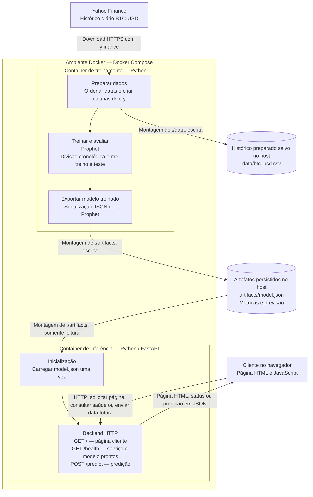
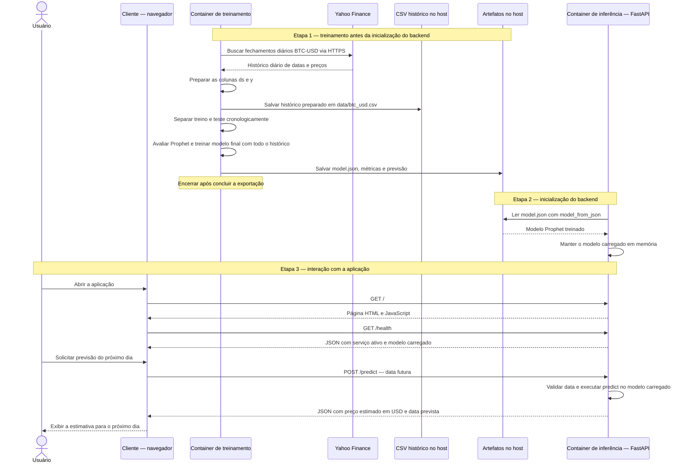

# Atividade Ponderada M7 — Predição do Bitcoin

Arquitetura planejada para estimar o fechamento do próximo dia do BTC-USD com Prophet e dados históricos do Yahoo Finance. Os preços são expressos em dólares americanos (USD).


## 1 - Diagramas 

Eu pedi para que o codex fizesse dois tipos de diagramas pra poder explicar e demonstrar a aplicação. A primeira imagem representa um fluxograma da arquitetura e o fluxo dos dados do projeto, que vai mostrar os componentes e suas conexões, entre, cliente, dados hitóricos e container do backend. Com esse fluxograma fica mais claro onde e como cada parte funciona e como o modelo chega ao backend.

Já na segunda imagem que é um UML de sequência, vai mostrar como esses componentes interagem en si ao longo do tempo. Onde primeiro acontece o treinanmento e a exporatção, depois o backend carrega o modelo e pra finalizar, o cliente envia uma solicitação e recebe a predição. E isso explica que o treinamento acontece antes, enquanto cada solicitação usa o modelo já carregado.

### 1.1 - Arquitetura e fluxo dos dados



### 1.2 - UML de sequência — treinamento e uso da aplicação




## 2 - Modelo Prophet

Depois de produzir os diagramas eu iniciei um .venv e nele instalei as dependências necessárias para dar o próximo passo no modelo.

Para fazer a predição decidi utilizar o modelo Prophet e também utilizar o dataset do yahoo finance, sendo assim, o modelo em questão utiliza o hítorico de preçoes do bitcoin em dólares e foram utilizados dados de 1.008 fechamentos diários de cerca de dois anos de diferença, sendo de 01/01/2024 a 04/10/2026. O script rganiza as datas, remove registros vazios ou duplicados e prepara as duas colunas exigidas pelo Prophet: ds, que contém a data, e y, que contém o preço de fechamento. O dia corrente é excluído porque seu fechamento ainda não está completo.

O Prophet ajusta uma tendência ao longo do tempo e acrescenta padrões semanais e anuais encontrados no histórico. Tendo esse componentes a gente faz uma combinação que produz uma estimativa do preço para uma data futura. Desativamos a sazonalidade dentro do dia, pois nossos dados têm apenas um fechamento por dia. Fazendo dessa forma, o modelo utiliza somente datas e preços, e fatores como notícias, volume de negociação e acontecimentos econômicos não entram no treinamento.

Para nós podermos avaliar o desempenho do modelo, nós primeiro treinamos uma primeira instância com os 978 registros mais antigos e depois uma segunda instância com todos os 1.008 registros.

### 2.1 - Resultado

Saída observada no treinamento local, antes da execução em Docker:

```text
Histórico: 1008 dias, de 2024-01-01 a 2026-10-04
MAE no teste: US$ 13,524.63
RMSE no teste: US$ 13,743.73
Previsão do fechamento do próximo dia em USD:
        ds        yhat   yhat_lower   yhat_upper
2026-10-05 82083.93628 75343.433593 88629.169015
```

O modelo estimou o fechamento de 05/10/2026, em UTC, em US$ 82.083,94, com um intervalo de incerteza calculado pelo Prophet entre US$ 75.343,43 e US$ 88.629,17.

## 3 - Treinamento em Docker

Comecei fazendo o Dockerfile do treinamento primeiro para depois fazer o backend e docker do back.

O Dockerfile de treino utiliza o pyhton 3.12 slim no Linux, ele também instala todas as dependências de requirements.txt e copia o script de treinamento. O treinamento acontece ao executar o container, por meio de python training/train.py. Lemprando que o "CMD" que é responsável pelo execução do treinamento quando o container é criado.

O compose.yaml define um único serviço, chamado training. As pastas data/ e artifacts/ do projeto são montadas em /app/data e /app/artifacts, com acesso de escrita. Assim, o CSV, o modelo JSON, as métricas e a previsão ficam salvos no computador depois que o container termina. A imagem tem o código e as dependências e os ambientes virtuais, caches e resultados locais são excluídos do contexto pelo arquivo do .dockerignore.

### 3.1 - Como executar

Com Docker e Docker Compose disponíveis, execute na pasta do projeto:

```bash
docker compose build training
docker compose run --rm training
```

O primeiro comando constrói a imagem `btc-prophet-training:local`. O segundo baixa o histórico do Yahoo Finance, avalia e treina o Prophet, salva os resultados e remove o container ao terminar. O download dos dados exige conexão com a internet. Cada execução atualiza os arquivos das pastas compartilhadas.

Resultados esperados após uma execução concluída com sucesso:

- `data/btc_usd.csv`: histórico usado no treinamento.
- `artifacts/model.json`: modelo Prophet treinado.
- `artifacts/metrics.json`: métricas da avaliação cronológica.
- `artifacts/previsao.csv`: previsão do próximo dia após o último fechamento disponível.


