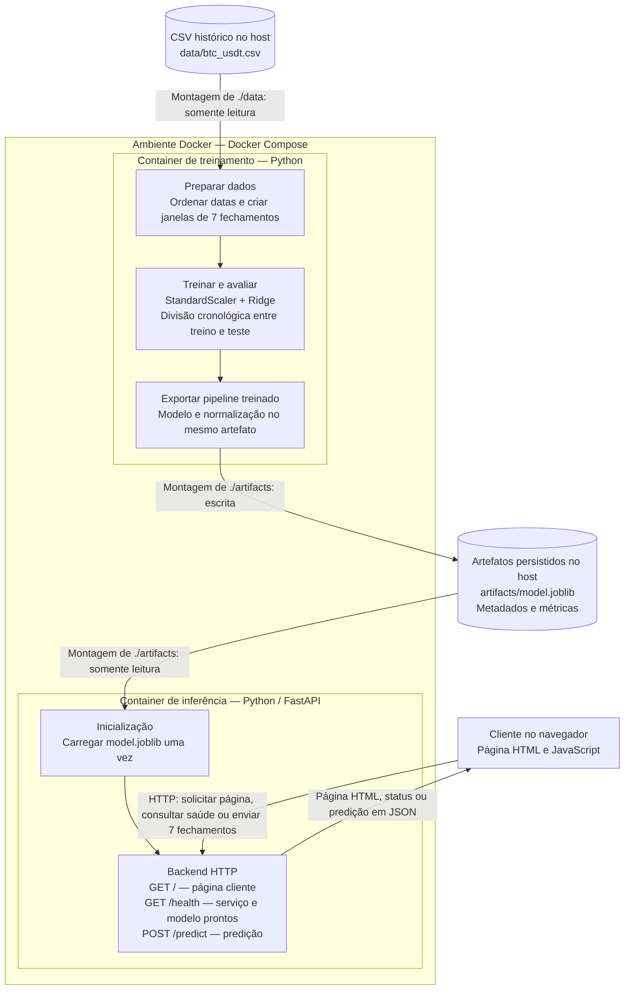
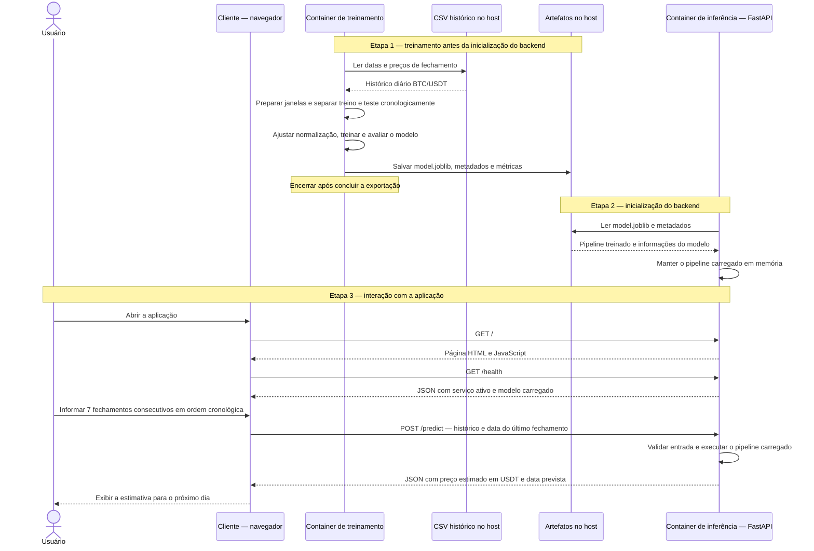

# Atividade Ponderada M7 — Predição do Bitcoin

Arquitetura planejada para estimar o fechamento do próximo dia do par BTC/USDT a partir dos sete fechamentos diários anteriores. Os diagramas representam o fluxo previsto para a implementação.

## Arquitetura e fluxo dos dados

O treinamento será executado primeiro e encerrará após gerar os artefatos. A pasta `artifacts/` ficará disponível para os dois containers por meio de bind mounts: o treinamento escreverá nela e o backend terá acesso somente para leitura. Após o treinamento terminar com sucesso, o backend será iniciado para carregar o modelo.

A normalização será ajustada apenas com os dados de treino e exportada junto ao modelo. A inferência usará esse mesmo pipeline, preservando o processamento utilizado no treinamento.

## UML de sequência — treinamento e uso da aplicação

Uma solicitação de predição executará apenas a inferência com o modelo já carregado. O backend validará a quantidade de fechamentos e os valores recebidos. O endpoint `/health` indicará que o serviço está pronto para atender solicitações com o modelo disponível.

As estimativas serão experimentais e suas limitações serão documentadas no devlog.
