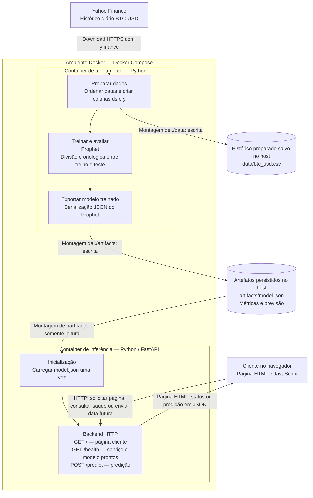
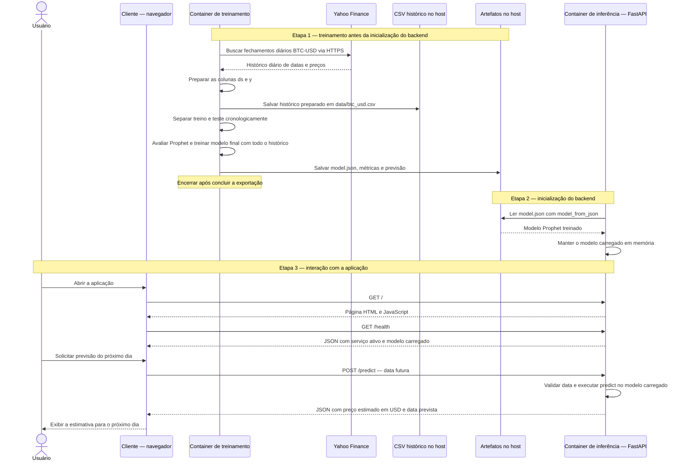

# Atividade Ponderada M7 — Predição do Bitcoin

Aplicação para estimar o fechamento do BTC-USD com Prophet e dados históricos do Yahoo Finance. Os preços são expressos em dólares americanos (USD). O treinamento e a inferência usam containers separados, e o cliente é uma página HTML e JavaScript servida pelo backend.


## 1 - Diagramas 

Eu pedi para que o codex fizesse dois tipos de diagramas pra poder explicar e demonstrar a aplicação. A primeira imagem representa um fluxograma da arquitetura e o fluxo dos dados do projeto, que vai mostrar os componentes e suas conexões, entre, cliente, dados hitóricos e container do backend. Com esse fluxograma fica mais claro onde e como cada parte funciona e como o modelo chega ao backend.

Já na segunda imagem que é um UML de sequência, vai mostrar como esses componentes interagem en si ao longo do tempo. Onde primeiro acontece o treinanmento e a exporatção, depois o backend carrega o modelo e pra finalizar, o cliente envia uma solicitação e recebe a predição. E isso explica que o treinamento acontece antes, enquanto cada solicitação usa o modelo já carregado.

### 1.1 - Arquitetura e fluxo dos dados



### 1.2 - UML de sequência — treinamento e uso da aplicação




## 2 - Modelo Prophet

Depois de produzir os diagramas eu iniciei um .venv-wsl e nele instalei as dependências necessárias para dar o próximo passo no modelo. Usei o .venv do ubunto porque o windows bloqueou o a instalação do prophet no .venv comum. O motivo eu não consegui encontrar.

Para fazer a predição decidi utilizar o modelo Prophet e também utilizar o dataset do yahoo finance, sendo assim, o modelo em questão utiliza o hítorico de preçoes do bitcoin em dólares e foram utilizados dados de 1.008 fechamentos diários de cerca de dois anos de diferença, sendo de 01/01/2024 a 04/10/2026. O script rganiza as datas, remove registros vazios ou duplicados e prepara as duas colunas exigidas pelo Prophet: ds, que contém a data, e y, que contém o preço de fechamento. O dia corrente é excluído porque seu fechamento ainda não está completo.

O Prophet ajusta uma tendência ao longo do tempo e acrescenta padrões semanais e anuais encontrados no histórico. Tendo esse componentes a gente faz uma combinação que produz uma estimativa do preço para uma data futura. Desativamos a sazonalidade dentro do dia, pois nossos dados têm apenas um fechamento por dia. Fazendo dessa forma, o modelo utiliza somente datas e preços, e fatores como notícias, volume de negociação e acontecimentos econômicos não entram no treinamento.

Para nós podermos avaliar o desempenho do modelo, nós primeiro treinamos uma primeira instância com os 978 registros mais antigos e depois uma segunda instância com todos os 1.008 registros.

### 2.1 - Resultado

Saída observada no treinamento local, antes da execução em Docker:

```text
Histórico: 1008 dias, de 2024-01-01 a 2026-10-04
MAE no teste: US$ 13,524.63
RMSE no teste: US$ 13,743.73
Previsão do fechamento do próximo dia em USD:
        ds        yhat   yhat_lower   yhat_upper
2026-10-05 82083.93628 75343.433593 88629.169015
```

O modelo estimou o fechamento de 05/10/2026, em UTC, em US$ 82.083,94, com um intervalo de incerteza calculado pelo Prophet entre US$ 75.343,43 e US$ 88.629,17.

## 3 - Treinamento em Docker

Comecei fazendo o Dockerfile do treinamento primeiro para depois fazer o backend e docker do back.

O Dockerfile de treino utiliza o pyhton 3.12 slim no Linux, ele também instala todas as dependências de requirements.txt e copia o script de treinamento. O treinamento acontece ao executar o container, por meio de python training/train.py. Lemprando que o "CMD" que é responsável pelo execução do treinamento quando o container é criado.

O serviço de treinamento em compose.yaml é chamado training. As pastas data/ e artifacts/ do projeto são montadas em /app/data e /app/artifacts, com acesso de escrita. Assim, o CSV, o modelo JSON, as métricas e a previsão ficam salvos no computador depois que o container termina. A imagem tem o código e as dependências e os ambientes virtuais, caches e resultados locais são excluídos do contexto pelo arquivo do .dockerignore.

### 3.1 - Como executar

Com Docker e Docker Compose disponíveis, execute na pasta do projeto:

```bash
docker compose build training
docker compose run --rm training
```

O primeiro comando constrói a imagem `btc-prophet-training:local`. O segundo baixa o histórico do Yahoo Finance, avalia e treina o Prophet, salva os resultados e remove o container ao terminar. O download dos dados exige conexão com a internet. Cada execução atualiza os arquivos das pastas compartilhadas.

Resultados esperados após uma execução concluída com sucesso:

- `data/btc_usd.csv`: histórico usado no treinamento.
- `artifacts/model.json`: modelo Prophet treinado.
- `artifacts/metrics.json`: métricas da avaliação cronológica.
- `artifacts/previsao.csv`: previsão do próximo dia após o último fechamento disponível.

## 4 - Backend Python e testes

O backend foi implementado com FastAPI em backend/main.py. Ao iniciar, ele lê artifacts/model.json com model_from_json e mantém o modelo Prophet em memória. Cada requisição usa esse modelo para calcular a previsão, sem baixar os dados novamente ou realizar outro treinamento. Se o arquivo estiver ausente ou inválido, a inicialização falha com uma mensagem indicando que é necessário executar o treinamento.

### 4.1 - Rotas e funcionamento

| Método e rota | Função |
| --- | --- |
| `GET /` | Abre a página de previsão. |
| `GET /health` | Mostra se o modelo está pronto e o limite de previsão. |
| `POST /predict` | Recebe uma data e retorna o preço estimado de BTC-USD em USD e o intervalo de incerteza. |
| `GET /docs` | Permite testar a API pelo navegador. |

Envie a data em um JSON como `{"date": "2026-10-05"}`. Ela representa o fechamento em UTC. A API aceita datas de 1 a 30 dias após o último fechamento usado no treino.

Datas fora do período retornam `400`. Datas inválidas, falta do campo `date` ou campos extras retornam `422`.

### 4.2 - Como executar localmente

Use Python 3.12 e o modelo salvo em `artifacts/model.json`. Crie o ambiente com `python -m venv .venv`, se necessário. No PowerShell, execute na pasta do projeto:

```powershell
.\.venv\Scripts\python.exe -m pip install -r backend/requirements.txt
.\.venv\Scripts\python.exe -m uvicorn backend.main:app --host 127.0.0.1 --port 8000
```

Teste pelo navegador em [/docs](http://127.0.0.1:8000/docs) ou pelo PowerShell em outro terminal:

```powershell
$health = Invoke-RestMethod -Uri "http://127.0.0.1:8000/health"
$health

$nextDate = ([datetime]::Parse($health.last_training_date)).AddDays(1).ToString("yyyy-MM-dd")
$body = @{ date = $nextDate } | ConvertTo-Json
Invoke-RestMethod -Uri "http://127.0.0.1:8000/predict" -Method Post -ContentType "application/json" -Body $body
```


### 4.3 - Testes automáticos

Os testes verificam se o modelo carrega, se a previsão bate com o CSV e se entradas inválidas são rejeitadas. Também testam modelo ausente ou arquivo inválido.

```powershell
.\.venv\Scripts\python.exe -m pip install -r backend/requirements.txt -r requirements-test.txt
.\.venv\Scripts\python.exe -m pytest tests/test_backend.py -q --basetemp=.cache/pytest-backend
```

`--basetemp` usa `.cache/pytest-backend` para evitar o erro de permissão do Windows. O pytest recria essa pasta a cada execução.

Resultado observado em 05/10/2026:

```text
13 passed, 1 warning in 1.55s
```

### 4.4 - Resultado das chamadas HTTP

`/health`, `/docs` e a previsão válida retornaram `200`. Uma data fora do período retornou `400`; uma data inválida retornou `422`.

Previsão de 05/10/2026, com histórico até 04/10/2026:

```json
{
  "symbol": "BTC-USD",
  "currency": "USD",
  "date": "2026-10-05",
  "predicted_close": 82083.9362801452,
  "lower_bound": 75123.6280992111,
  "upper_bound": 88912.48088669937,
  "interval_width": 0.8
}
```

O preço foi US$ 82.083,94, igual ao resultado do treinamento. Os limites do intervalo de 80% podem variar porque o Prophet usa amostragem aleatória.

## 5 - Docker do backend e aplicação cliente

O `backend/Dockerfile` cria a imagem `btc-prophet-backend:local` com a API e a página cliente. Ele inicia o Uvicorn na porta 8000 e tem os comandos comentados.

O backend recebe o modelo pela pasta `./artifacts`, montada em `/app/artifacts` como somente leitura. Ele carrega o JSON ao iniciar. O healthcheck consulta `/health` para confirmar que a aplicação está pronta.

O treinamento é executado separadamente. `docker compose up` inicia o backend; para treinar, use `docker compose run --rm training`.

### 5.1 - Cliente no navegador

O cliente fica em `frontend/` e é servido pelo FastAPI. A página consulta `/health` para definir as datas disponíveis. Ao enviar o formulário, chama `/predict` e mostra o preço estimado e o intervalo em USD.

O botão fica desativado durante a consulta. A página exibe erros, permite tentar novamente e esconde a previsão anterior ao mudar a data.

### 5.2 - Executar a solução completa

Com Docker Desktop aberto, execute na pasta do projeto:

```bash
docker compose build training backend
docker compose run --rm training
docker compose up -d --wait backend
```

O treino salva o modelo e termina. O backend continua rodando; `--wait` espera a aplicação ficar pronta. Abra [a página](http://127.0.0.1:8000) e clique em **Consultar previsão**. A documentação fica em [/docs](http://127.0.0.1:8000/docs).

Se o modelo já estiver salvo, basta iniciar o backend:

```bash
docker compose up -d --build --wait backend
```

Para ver o estado e os logs ou encerrar a aplicação:

```bash
docker compose ps
docker compose logs backend
docker compose down
```

Para atualizar o modelo, pare o backend, treine e inicie novamente:

```bash
docker compose stop backend
docker compose run --rm training
docker compose up -d --wait backend
```

Use internet para baixar as imagens e treinar. A porta 8000 precisa estar livre; encerre o Uvicorn local antes de iniciar o container.

## 6 - Testes finais e evidências

Em 05/10/2026, o container iniciou como `healthy`. O modelo estava montado em `/app/artifacts`, com modo `ro` e `RW: false` (somente leitura).

Resultado dos testes após adicionar a página cliente:

```text
16 passed, 1 warning in 1.86s
```

Os testes também conferem o HTML, o CSS e o JavaScript. O aviso é sobre a descontinuação de `httpx` no `TestClient`; nenhum teste falhou.

### 6.1 - Integração HTTP com o container

Com o backend rodando, execute `tests/smoke_test.py` para testar as chamadas HTTP e comparar a previsão com o CSV do treinamento:

```powershell
.\.venv\Scripts\python.exe -X utf8 tests/smoke_test.py
```

Resultado observado:

```text
GET /: 200
GET /health: 200
POST /predict: 200
POST /predict com data fora do período: 400
POST /predict com data inválida: 422
Integração HTTP concluída: previsão igual ao artefato exportado.
```

Previsão retornada pelo container:

```json
{
  "symbol": "BTC-USD",
  "currency": "USD",
  "date": "2026-10-05",
  "predicted_close": 82083.9362801452,
  "lower_bound": 75501.08637153576,
  "upper_bound": 88856.33648057407,
  "interval_width": 0.8
}
```

### 6.2 - Verificação do JavaScript

Sem acesso à automação do navegador, testei o JavaScript com jsdom. O teste simula a página e chama a API real. A aparência ainda precisa ser conferida no navegador.

Para esse teste opcional, use Node.js 24. O jsdom fica em `.cache/` e é usado só nos testes:

```powershell
npm.cmd install --prefix .cache/frontend-qa --no-save --package-lock=false --cache .cache/npm --ignore-scripts jsdom@29.1.1
node tests/test_frontend.cjs
```

As cinco verificações passaram: carregamento, previsão, datas inválidas, erros e reconexão. Também validei a sintaxe com `node --check frontend/app.js`.

### 7 - Conclusão

Com essa atividade, eu integrei o modelo prophet, o backend em python e a página cliente. O treinamento e o backend funcionam em containers separados, e a página permite consultar a previsão da moeda Bitcoin. Os testes confirmaram que a comunicação entre as partes  criadas funcionou e a os containeiers funcionaram corretamente e separadamente, com cada um tendo sua responsabilidade.
